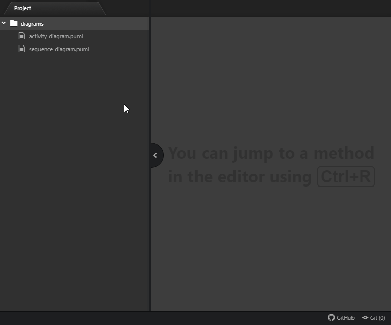

# PlantUML Bundle

A fork of [plantuml-preview](https://github.com/peele/plantuml-preview/) with syntax highlighting rules from [language-plantuml](https://github.com/plafue/language-plantuml/), automatic configuration of plantuml's jar from [node-plantuml](https://www.npmjs.com/package/node-plantuml) and new features.

## Features

#### > plantuml-bundle
- Bulk generation of diagram's images
  - Can generate the images (PNG, SVG and TXT) for ALL diagrams of a folder
- Extensible Snippets
  - Set in Configuration the path of the code Snippets you want to use with PlantUML

#### > from plantuml-preview
- Generate diagrams and display in split pane
  - Output formats: svg, png
  - Context menu command to copy diagram
    - SVG as XML
    - PNG as PNG
  - Images are only generated on preview toggle if the expected image files do not exist or are out of date
  - Regenerate on save
- Supports multipage diagrams
  - `newpage` within `@startuml`/`@enduml`  
  - Multiple `@startuml`/`@enduml` within file
  - Combinations of both
- Handling of `@startuml filename`. Images may not display if the extension on the filename does not match the output format.
- Charset of the text editor will be passed to PlantUML
- Zoom to fit option
  - Configuration setting for initial value
  - Checkbox control for each preview
- Scaled zooming
  - Maintained when regenerating on save
  - Maintained when output format is changed
- Use temporary directory option
  - Configuration setting for initial value
  - Checkbox control for each preview

#### > from language-plantuml
- Basic support for syntax highlighting of PlantUML files in atom.

#### > from node-plantuml
- Automatic download and configuration of plantuml's jar
  - Make sure you have access to the following URL: https://sourceforge.net/projects/plantuml/files/

---

## Configuration

### Language
- `Snippets Path`: The path to the folder with your custom snippets for PlantUML diagrams. Useful when they're available in a Git repository.

### Preview
- `Beautify XML`: Use js-beautify on XML when copying and generating SVG diagrams, probably pointless, default = true
- `Bring To Front`: Bring preview to front when parent editor gains focus
  - Default = false
  - Works best if `fuzzy-finder:Search All Panes` = true
  - *See [CHANGELOG](https://github.com/peele/plantuml-preview/blob/master/CHANGELOG.md), don't know if this feature is necessary*
- `Display Filename Above UML Diagrams`: Default = true
- `Graphvis Dot Executable`: Path of dot executable, [Graphviz](http://www.graphviz.org/)
- `Additional PlantUML Arguments`: Free form text field for additional arguments to PlantUML. Added immediately after the `-jar` argument.
- `PlantUML Jar`: Path of PlantUML jar. Only necessary if the automatic configuration of the plantuml.jar fails.
- `Java Executable`: Path of Java executable, default = java
- `Additional Java Arguments`: Free form text field for additional arguments for java call.
- `Output Format`: Select png or svg output, default = svg
- `Use Temp Directory`: Output diagrams to OS temporary directory, default = true
- `Zoom To Fit`: The initial setting for new preview panes, default = true
