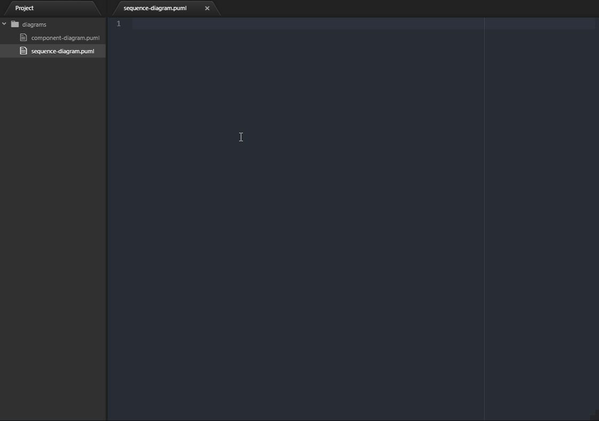

# PlantUML Toolkit
> Everything you need to design UML diagrams using Atom editor

[![NPM Version][npm-image]][npm-url]
[![Build Status][travis-image]][travis-url]
[![Downloads Stats][npm-downloads]][npm-url]

PlantUML Toolkit (plantuml-toolkit) is an Atom's package with all the tools you need to easily design, code, preview and generate UML diagrams using [PlantUML](http://plantuml.com/).

It's a fork of [plantuml-preview](https://github.com/peele/plantuml-preview/) with syntax highlighting rules from [language-plantuml](https://github.com/plafue/language-plantuml/), automatic configuration of plantuml's jar from [node-plantuml](https://www.npmjs.com/package/node-plantuml) and a lot of new features.

## Installation

Using Atom:

```
1. In Atom's settings select `Install`
2. Search for `plantuml-toolkit`
3. Click on 'Install'
```

Using command line:

```sh
apm install plantuml-toolkit
```
> If the `apm` was not found by your command prompt/terminal, please visit [Atom's installation guide][atom-install-guide] and follow the instructions to install it.


## Usage example



_For more examples and usage, please refer to the [Wiki][wiki]._

## Development setup

```
1. Checkout plantuml-toolkit's repository under %ATOM_HOME%/packages
2. Using your command line tool navigate to %ATOM_HOME%/packages
3. Execute the following command:
    npm install
```

## Release History

* 0.1.0
    * Fisrt release
* 0.2.0
    * Sync scrolling
    * Bug fixes
    * Improved text selection on click

## Meta

Maintainer: Matheus Azevedo - [@MatheusAzv](https://twitter.com/MatheusAzv)

[Capco Digital](http://github.com/capcodigital) – [@CapcoDigital](https://twitter.com/capcodigital) – oss@capco.com

Distributed under the MIT license. See ``LICENSE`` for more information.

[https://github.com/MatheusAze/](https://github.com/MatheusAze/)

## Contributing

First read the contribution guidelines at [[CONTRIBUTING]]

Then:
1. Fork it (<https://github.com/MatheusAze/plantuml-toolkit/fork>)
2. Create your feature branch (`git checkout -b feature/fooBar`)
3. Commit your changes (`git commit -am 'Add some fooBar'`)
4. Push to the branch (`git push origin feature/fooBar`)
5. Create a new Pull Request

<!-- Markdown link & img dfn's -->
[npm-image]: https://img.shields.io/npm/v/datadog-metrics.svg?style=flat-square
[npm-url]: https://npmjs.org/package/datadog-metrics
[npm-downloads]: https://img.shields.io/npm/dm/datadog-metrics.svg?style=flat-square
[travis-image]: https://img.shields.io/travis/dbader/node-datadog-metrics/master.svg?style=flat-square
[travis-url]: https://travis-ci.org/dbader/node-datadog-metrics
[wiki]: https://github.com/yourname/yourproject/wiki
[atom-install-guide]: https://flight-manual.atom.io/getting-started/sections/installing-atom/
